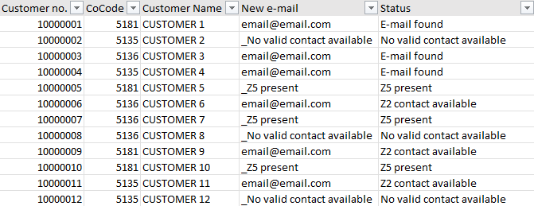
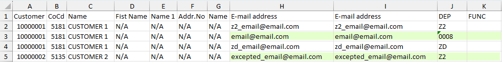

# VBA Z5 Contact Checker

The purpose of this project was to check a master file for missing dunning contacts (Z5) and set a relevant e-mail address, when available. 
VBA code was needed here, because the excel file contained a considerable amount of customer accounts which were multiplied, due to different contact types.

## Quick overview

What the code does is the following:
1. Look through each customer account one by one
2. Look through each contact type:
    1. If Z5 found &rarr; do nothing
    2. If no Z5 available &rarr; pick one Z008 or 0002 contact
    3. If no Z008 or 0002 found &rarr; pick one of the remaining contacts, except Z2
    4. If no other remaining contacts &rarr; pick Z2, except one specific e-mail address.
    5. If nothing available &rarr; do nothing.

The result of this project was processing 150k accounts and making the creation of 45k Z5 contacts for dunning letters possible. 
The final file looked like below:

As an example and for comparison, the first two customer accounts would have extracted the data and results from the below:

**Disclaimer!** 
The code was written with the help of Microsoft Copilot, but without proper human guidance the AI would not have made this possible with just a copy-paste. 
This would explain why in some places the code probably could have been better designed.